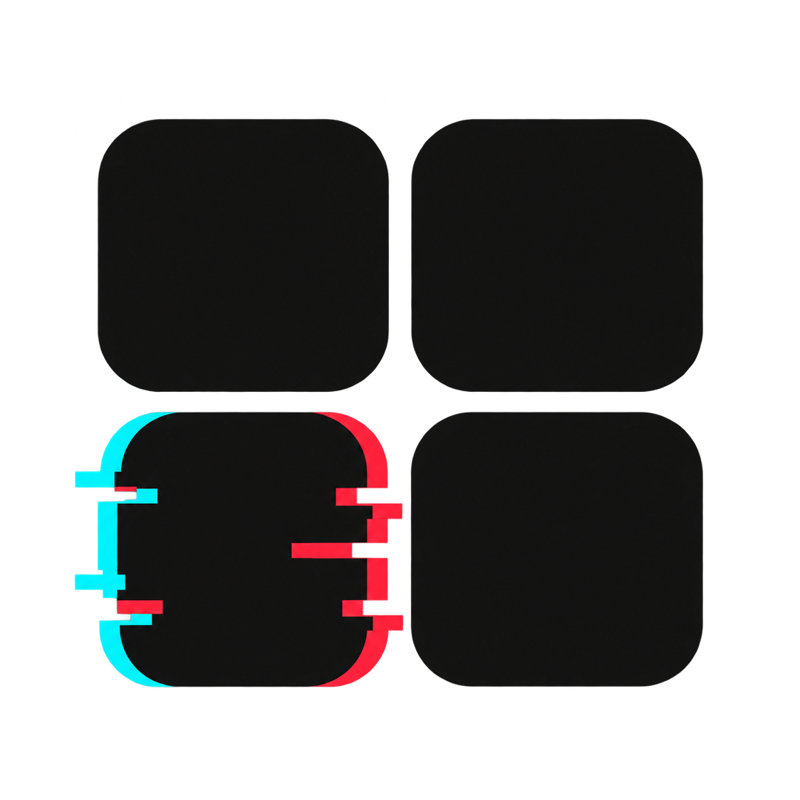

# MyCatalog

[English](README.md) · [Español](README.es.md) · **Català**

**Catàleg personal de mitjans, local i privat**

<p align="center">
  
</p>

MyCatalog és una aplicació d'escriptori local per gestionar una col·lecció
personal de música, pel·lícules, sèries i llibres.

El catàleg es manté a l'ordinador local. SQLite emmagatzema la col·lecció, les
portades descarregades es guarden en carpetes locals i les API externes només
s'utilitzen per cercar i completar les fitxes del catàleg.

## Funcionalitats

- Catàleg musical amb cerca i importació de publicacions des de Discogs.
- Catàleg de pel·lícules i sèries amb cerca i enriquiment des de TMDb.
- Catàleg de llibres amb consultes a ISBN, Open Library i Google Books.
- Descàrrega local de portades i pòsters en format WebP.
- Vistes de catàleg amb cerca, detall i edició.
- Creació, edició i eliminació manual d'elements.
- Configuració de format físic, edició, embalatge, ubicació i llistes de pistes.
- Interfície disponible en anglès, castellà i català.
- Persistència local a SQLite, amb importació i migració des de JSON.
- Informes de manteniment per a portades absents i inconsistències de dades.
- Shell d'Electron amb backend local en Flask i frontend en Next.js.

La compatibilitat amb videojocs queda aparcada com a tasca futura. L'aplicació
actual no necessita cap proveïdor de metadades de videojocs.

## Àrees de l'aplicació

| Àrea | Funció |
| --- | --- |
| `Music` | Consultar, cercar, importar, editar i mantenir discos. |
| `Movies` | Consultar, cercar, importar, editar i mantenir pel·lícules i sèries. |
| `Books` | Cercar llibres per títol o ISBN i gestionar-ne les fitxes. |
| `Settings` | Configurar els proveïdors de metadades i la ruta de SQLite. |
| `Maintenance` | Localitzar portades, revisar fitxers i detectar inconsistències. |

## Tecnologies

- Electron per iniciar i aturar els serveis locals.
- Flask i Python per a l'API local i les integracions de metadades.
- SQLite per a la base de dades local del catàleg.
- Dades JSON dins de SQLite per conservar els camps flexibles de cada proveïdor.
- Next.js, React i TypeScript per a la interfície.
- Imatges WebP emmagatzemades fora de la base de dades.

## Requisits

- Node.js 20 o superior i npm.
- Python 3.11 o superior.
- Un sistema de fitxers local amb permisos d'escriptura per a la base de dades i les imatges.
- Credencials de les API que vulguis utilitzar:
  - TMDb per a pel·lícules i sèries.
  - Discogs per a música.
  - Google Books per a consultes opcionals de llibres.

Open Library no necessita cap clau d'API. Quan les dades i les imatges ja són
locals, consultar el catàleg no requereix connexió de xarxa.

## Instal·lació

Instal·la les dependències d'escriptori des de l'arrel del repositori:

```bash
npm install
npm --prefix frontend install
```

Crea i prepara l'entorn del backend:

```bash
python3 -m venv backend/.venv
backend/.venv/bin/pip install -r backend/requirements.txt
```

Crea la configuració local a partir de l'exemple segur:

```bash
cp backend/config.example.yaml backend/config.yaml
```

Completa les credencials dels proveïdors a `backend/config.yaml`. Aquest fitxer
és exclusivament local i no s'ha d'incloure mai a Git.

## Desenvolupament

Inicia l'entorn complet de desenvolupament:

```bash
npm run dev
```

Electron inicia el backend Flask i el servidor de desenvolupament de Next.js
localment i obre l'aplicació quan els dos serveis estan disponibles.

Per iniciar els serveis per separat:

```bash
cd backend
.venv/bin/python server.py
```

```bash
cd frontend
npm run dev
```

El backend estarà disponible a `http://127.0.0.1:5000` i el frontend a
`http://localhost:3000` quan s'executin de manera independent.

## Compilació de producció

Genera una compilació local del renderer de Next.js:

```bash
npm run build:frontend
```

Instal·la les dependències d'empaquetament:

```bash
npm install
npm --prefix frontend install
backend/.venv/bin/python -m pip install -r backend/requirements-build.txt
```

A macOS, genera el DMG amb:

```bash
npm run build:mac
```

El resultat queda a `out/mac/MyCatalog-<version>-mac-<arch>.dmg`. La comanda compila el
frontend, empaqueta el backend Python amb PyInstaller i crea l'aplicació
d'Electron.

A Windows, executa aquesta comanda des de Windows perquè el backend de
PyInstaller és específic de la plataforma:

```bash
npm run build:win
```

El resultat és `out/win/MyCatalog-<version>-win-<arch>.exe`. Les dades del
catàleg es desen a la carpeta de dades de l'usuari, fora de la instal·lació.

## Aplicació d'escriptori

MyCatalog està dissenyada com una aplicació privada i monousuari d'Electron
per a macOS i Windows. El renderer es comunica per HTTP amb el servei
Flask local. Electron selecciona la icona corresponent a cada plataforma:

```text
electron/assets/mycatalog-icon-padded.png   macOS
electron/assets/mycatalog-icon-padded.ico   Windows
```

Electron inicia el backend amb `backend/.venv` quan aquest entorn existeix.
Pots definir `MYCATALOG_PYTHON` si necessites utilitzar un altre executable de
Python.

## Ús

1. Crea `backend/config.yaml` a partir de `backend/config.example.yaml` i afegeix les credencials necessàries.
2. Inicia MyCatalog amb `npm run dev`.
3. Consulta el catàleg des de la vista principal.
4. Utilitza els panells de cerca dels proveïdors per importar música, pel·lícules, sèries o llibres.
5. Activa el mode editor quan necessitis editar o eliminar elements.
6. Utilitza Configuració i Manteniment per actualitzar les opcions, localitzar imatges, eliminar imatges sense ús i revisar la qualitat de les dades.

## Emmagatzematge de dades

MyCatalog **no** utilitza cap base de dades remota. El catàleg persistent es
guarda a:

```text
backend/db/catalog.sqlite3
```

La base de dades actual es va migrar des dels catàlegs JSON anteriors. Els
fitxers d'origen i la còpia de migració continuen disponibles localment:

```text
backend/db/music.json
backend/db/movies.json
backend/db/books.json
backend/db/backups/json-before-sqlite-*/
```

Les imatges descarregades es guarden fora de SQLite:

```text
backend/covers/music/
backend/covers/movies/
backend/covers/books/
```

### Consideracions importants sobre l'emmagatzematge

- La còpia de seguretat de Configuració descarrega un ZIP amb `backend/db/catalog.sqlite3` i `backend/covers/`; les còpies antigues `.sqlite3` independents es poden continuar restaurant.
- L'acció d'imatges locals reconcilia `backend/covers/` amb la base de dades: descarrega les imatges que falten, conserva els fitxers referenciats i elimina les imatges sense ús.
- Les dades reals del catàleg, les imatges, els informes, les peticions i les credencials es mantenen fora de Git.
- Els fitxers JSON es conserven com a còpia temporal de la migració i només s'han d'eliminar després de comprovar la base SQLite de manera independent.
- L'aplicació està dissenyada per a una instal·lació privada i monousuari.
- No exposis públicament el backend ni el seu directori de dades: poden contenir informació personal de la col·lecció i credencials de proveïdors.

## Model de dades

SQLite utilitza una taula compartida `media_items`. Cada catàleg té la seva
pròpia col·lecció, identificador estable, posició d'inserció i contingut JSON:

```text
collection   item_id   position   payload
album        123       0          { ... metadades de Discogs ... }
movie        456       0          { ... metadades de TMDb ... }
book         isbn...   0          { ... metadades de llibres ... }
```

Aquest disseny conserva els camps específics de cada proveïdor i permet utilitzar
transaccions d'escriptura, a més de facilitar futurs índexs o taules
normalitzades sense canviar l'API pública.

## API

### Salut i informació del servei

```http
GET /
GET /health
```

### Dades del catàleg

```http
GET  /api/music
POST /api/music
GET  /api/movies
POST /api/movies
GET  /api/books
POST /api/books
```

### Operacions del catàleg

```http
DELETE /api/items/<kind>/<item_id>
PATCH  /api/items/<kind>/<item_id>
POST   /api/images/localize
```

### Consultes externes i manteniment

```http
GET  /api/books/search
GET  /api/books/metadata
POST /api/books/resolve
POST /api/external/music/search
POST /api/external/music/import
GET  /api/inconsistencies
POST /api/files/reveal
```

## Estructura del projecte

```text
mycatalog/
├── backend/                 # API Flask, proveïdors, SQLite i scripts
│   ├── src/                 # Serveis del catàleg i emmagatzematge
│   ├── scripts/             # Ajudes de migració i manteniment
│   ├── config.example.yaml  # Plantilla de configuració segura
│   ├── db/                  # Base SQLite i fitxers JSON locals
│   └── covers/              # Imatges locals, ignorades per Git
├── frontend/                # Renderer Next.js i components de la interfície
├── electron/                # Procés principal i recursos d'Electron
├── package.json             # Scripts d'escriptori i dependència d'Electron
├── README.md                # Documentació en anglès
├── README.es.md             # Documentació en castellà
└── README.ca.md             # Documentació en català
```

## Scripts disponibles

| Comanda | Descripció |
| --- | --- |
| `npm run dev` | Inicia el backend, el frontend i el shell d'Electron. |
| `npm run build:frontend` | Genera una compilació de producció del renderer de Next.js. |
| `npm run build:backend` | Empaqueta el backend Python amb PyInstaller. |
| `npm run build:mac` | Genera l'instal·lador `.dmg` de macOS. |
| `npm run build:win` | Genera l'instal·lador `.exe` de Windows; cal executar-lo a Windows. |
| `npm run lint:frontend` | Executa el lint del frontend. |
| `python3 scripts/migrate_json_to_sqlite.py` | Importa els catàlegs JSON a SQLite. |
| `python3 scripts/normalize_music_track_positions.py` | Informa o normalitza les posicions de les pistes. |
| `python3 scripts/repair_music_covers.py` | Cerca i, opcionalment, repara portades musicals absents. |

Executa els scripts del backend des del directori `backend/`.

## Validació

Abans de fer commits de codi, executa:

```bash
node --check electron/main.js
cd backend && .venv/bin/python -m py_compile src/*.py scripts/*.py
cd ../frontend && npm run build
```

Per a una migració de l'emmagatzematge local, comprova els recomptes d'elements
a SQLite, revisa les rutes de l'aplicació i conserva la còpia JSON generada fins
que hagis revisat el catàleg.
