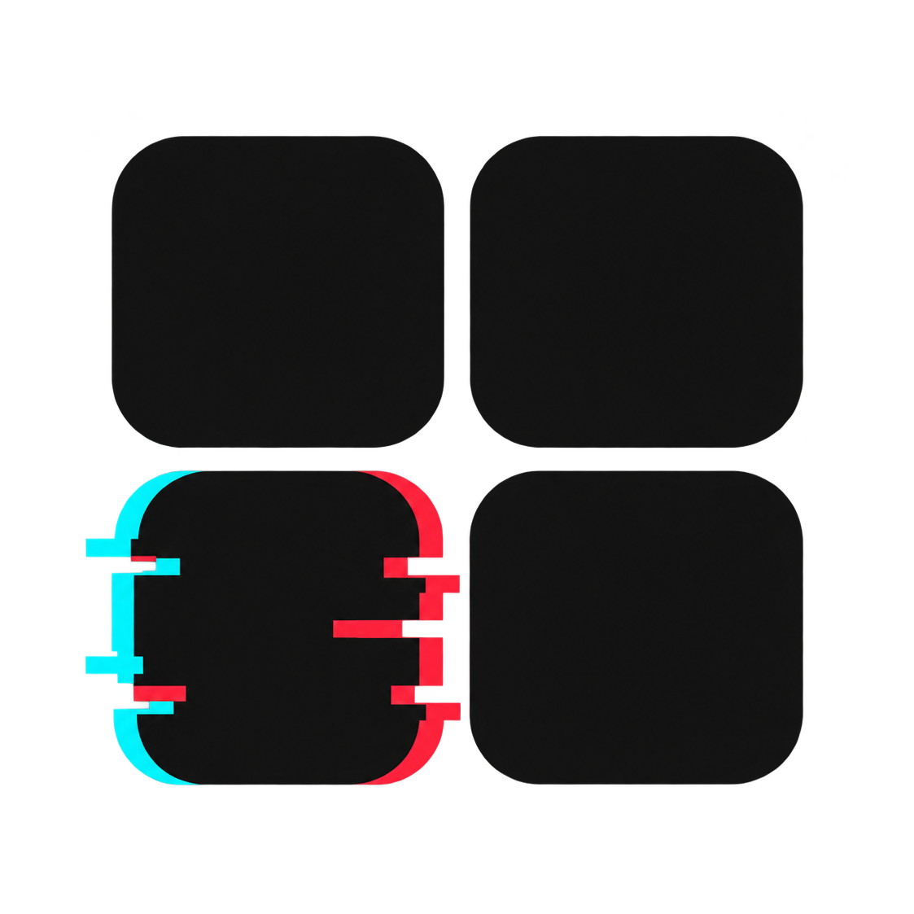

# MyCatalog

**Local-first personal media catalogue**

<p align="center">
  
</p>

MyCatalog `0.1.0` is a local desktop application for managing a personal
collection of music, movies, TV shows, and books.

The catalogue stays on the local computer. SQLite stores the collection,
downloaded artwork remains in the local covers directory, and external APIs
are used only to search for and enrich catalogue entries.

## Features

- Music catalogue with Discogs search and release import.
- Movie and TV catalogue with TMDb search and metadata enrichment.
- Book catalogue with ISBN, Open Library, and Google Books lookups.
- Local cover and poster downloads in WebP format.
- Searchable catalogue views with detail and editing flows.
- Manual creation, editing, and deletion of catalogue entries.
- Configurable physical format, edition, packaging, location, and tracklists.
- English, Spanish, and Catalan interface options.
- Local SQLite persistence with JSON import and migration support.
- Maintenance reports for missing artwork and inconsistent music track numbers.
- Electron desktop shell with a local Flask backend and Next.js renderer.

Video game support is intentionally parked as a future TODO. The current
application does not require a game metadata provider.

## Application routes

| Area | Purpose |
| --- | --- |
| `Music` | Browse, search, import, edit, and maintain music releases. |
| `Movies` | Browse, search, import, edit, and maintain movies and TV shows. |
| `Books` | Search by title or ISBN and manage book metadata. |
| `Settings` | Configure metadata providers and the local SQLite database path. |
| `Maintenance` | Localize artwork, inspect files, and report catalogue inconsistencies. |

## Technology stack

- Electron with a local main process for starting and stopping the services.
- Flask and Python for the local HTTP API and metadata integrations.
- SQLite for the local catalogue database.
- JSON payloads inside SQLite to preserve flexible provider metadata.
- Next.js, React, and TypeScript for the user interface.
- WebP artwork stored outside the database.

## Requirements

- Node.js 20+ and npm.
- Python 3.11+.
- A writable local filesystem for the catalogue database and artwork.
- API credentials for the providers you want to use:
  - TMDb for movies and TV shows.
  - Discogs for music.
  - Google Books for optional book lookups.

Open Library does not require an API key. Browsing the local catalogue does not
require a network connection once its data and artwork are already local.

## Installation

Install the desktop dependencies from the repository root:

```bash
npm install
npm --prefix frontend install
```

Create and prepare the backend environment:

```bash
python3 -m venv backend/.venv
backend/.venv/bin/pip install -r backend/requirements.txt
```

Create the local configuration from the safe example:

```bash
cp backend/config.example.yaml backend/config.yaml
```

Fill in the provider credentials in `backend/config.yaml`. This file is local
only and must never be committed.

## Development

Start the complete desktop development environment:

```bash
npm run dev
```

Electron starts the Flask backend and the Next.js development server locally,
then opens the application after both services are ready.

To run the services separately:

```bash
cd backend
.venv/bin/python server.py
```

```bash
cd frontend
npm run dev
```

The backend is available at `http://127.0.0.1:5000` and the frontend at
`http://localhost:3000` when started independently.

## Production build

Build the Next.js renderer locally:

```bash
npm run build:frontend
```

The Electron packaging workflow is not configured yet. The supported desktop
workflow at this stage is the local development command above.

## Desktop application

MyCatalog is designed as a private, single-user Electron application for
macOS, Windows, and Linux. The renderer talks to the local Flask service over
HTTP. Electron selects the platform-appropriate application icon:

```text
electron/assets/mycatalog-icon-padded.png   macOS and Linux
electron/assets/mycatalog-icon-padded.ico   Windows
```

The backend process is started by Electron from `backend/.venv` when that
environment exists. Set `MYCATALOG_PYTHON` if a different Python executable is
required.

## Usage

1. Create `backend/config.yaml` from `backend/config.example.yaml` and add the
   provider credentials you need.
2. Start MyCatalog with `npm run dev`.
3. Browse the local catalogue from the main view.
4. Use the provider search panels to import music, movies, or books.
5. Enable editor mode when you need to edit or delete catalogue entries.
6. Use the settings and maintenance panels to update configuration, localize
   remote artwork, remove unreferenced artwork, and inspect data quality.

## Data storage

MyCatalog does **not** use a remote database. Its persistent catalogue store
is:

```text
backend/db/catalog.sqlite3
```

The current database was migrated from the previous JSON catalogues. The source
files remain available locally, together with the migration backup:

```text
backend/db/music.json
backend/db/movies.json
backend/db/books.json
backend/db/backups/json-before-sqlite-*/
```

Downloaded artwork is kept outside SQLite:

```text
backend/covers/music/
backend/covers/movies/
backend/covers/books/
```

### Important storage considerations

- The Settings backup downloads a ZIP containing `backend/db/catalog.sqlite3`
  and `backend/covers/`; older standalone `.sqlite3` backups remain restorable.
- The local-artwork action reconciles `backend/covers/` with the database: it
  downloads missing images, preserves referenced files, and removes unused
  artwork files.
- Real catalogue data, artwork, reports, request files, and credentials stay
  outside Git.
- The JSON files are retained as a temporary migration backup and can be
  removed only after the SQLite database has been checked independently.
- The application is designed for a private, single-user desktop installation.
- Do not expose the backend or its data directory publicly: it may contain
  personal collection information and provider credentials.

## Data model

SQLite keeps one shared `media_items` table. Each catalogue has its own
collection name, stable item identifier, insertion position, and JSON payload:

```text
collection   item_id   position   payload
album        123       0          { ... Discogs metadata ... }
movie        456       0          { ... TMDb metadata ... }
book         isbn...   0          { ... book metadata ... }
```

This preserves the provider-specific fields already used by the application
while giving writes transaction support and allowing future indexes or
normalized tables to be introduced without changing the public API.

## API

### Health and service information

```http
GET /
GET /health
```

### Catalogue data

```http
GET  /api/music
POST /api/music
GET  /api/movies
POST /api/movies
GET  /api/books
POST /api/books
```

### Catalogue operations

```http
DELETE /api/items/<kind>/<item_id>
PATCH  /api/items/<kind>/<item_id>
POST   /api/images/localize
```

### External lookup and maintenance

```http
GET  /api/books/search
GET  /api/books/metadata
POST /api/books/resolve
POST /api/external/music/search
POST /api/external/music/import
GET  /api/inconsistencies
POST /api/files/reveal
```

## Project structure

```text
mycatalog/
├── backend/                 # Flask API, providers, SQLite, scripts, local data
│   ├── src/                 # Catalogue services and storage backends
│   ├── scripts/             # Migration and maintenance helpers
│   ├── config.example.yaml  # Safe configuration template
│   ├── db/                  # Local SQLite database and JSON migration files
│   └── covers/              # Local artwork, ignored by Git
├── frontend/                # Next.js renderer and UI components
├── electron/                # Electron main process and application assets
├── package.json             # Desktop scripts and Electron dependency
└── README.md                # Project documentation
```

## Available scripts

| Command | Description |
| --- | --- |
| `npm run dev` | Start the backend, frontend, and Electron shell. |
| `npm run build:frontend` | Create a production build of the Next.js renderer. |
| `npm run lint:frontend` | Run the frontend lint command. |
| `python3 scripts/migrate_json_to_sqlite.py` | Import the JSON catalogues into SQLite. |
| `python3 scripts/normalize_music_track_positions.py` | Report or normalize music track positions. |
| `python3 scripts/repair_music_covers.py` | Find and optionally repair missing music covers. |

Run backend scripts from the `backend/` directory.

## Validation

Before committing code changes, run:

```bash
node --check electron/main.js
cd backend && .venv/bin/python -m py_compile src/*.py scripts/*.py
cd ../frontend && npm run build
```

For a local storage migration, verify the item counts in the SQLite database,
check the application routes, and keep the generated JSON backup until the
catalogue has been reviewed.
